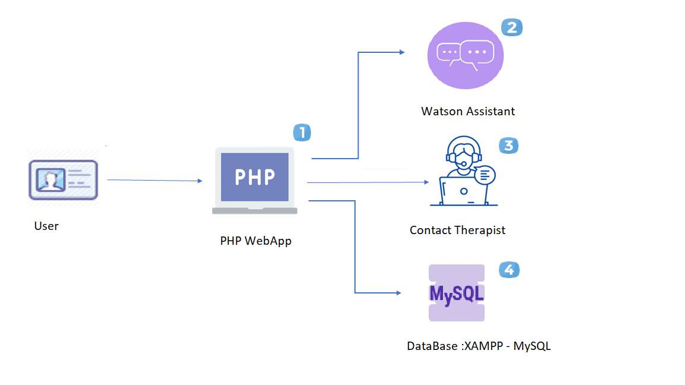

# BrainStorm

## Contents

1. [Short description](#short-description)
1. [Demo video](#demo-video)
1. [The architecture](#the-architecture)
1. [Long description](#long-description)
1. [Getting started](#getting-started)
1. [Running the tests](#running-the-tests)
1. [Built with](#built-with)
1. [Acknowledgment](#acknowledgment)

## Short description

### What's the problem?

Because of the lockdown and social distancing situation, all of us are craving for the people with whom we had long drawn discussions over just a cup of tea. But for some of us, the issue is way more than that. Social contact helps us to cope with stress and major life changes and when this emotion doesn’t find a way out, it starts to affect our mental health. Taboo around mental health issues has been around for decades now but the times are changing and it’s changing fast. People have started accepting it and spreading the word of cognizance to those around them.

### How can technology help?

Since the boom of social networking sites, we all have found a way to stay in touch even with that 4th grade friend who we never talked to! Then why not use this as a tool to bring together people with mental health issues and help them fare through the tough times. Why not make the online world as fun and as warm as the one we share with our friends and families? 

### The idea

As Glenn Close said “What mental health needs is more sunlight, more candor and more unashamed conversations”. Hence, we try to bring our people an app that would help them have those candor conversations, a community without judgements and above all a community that understands. IBM has given us this opportunity to make an impact that matters by letting us harness its services like Watson

## Demo video
Watch the demo video here:
https://youtu.be/lNbxE8NyPNI
## The architecture

1.	The user Logins to the site and fills profile details.
2.	Watson Assistant to interact with the issues user is facing.
3.	User can contact Therapist for further assistance.
4.	The app stores the user details and also stores user feedback about therapist to help others choose the right therapist .

## Long description

[More detail is available here](Description.md)

## Getting started

These instructions will get you a copy of the project up and running on your local machine for development and testing purposes.

### Prerequisites
 What things you need to install the software and how to install them
1.	Download XAMPP - https://www.apachefriends.org/download.html
2.	Text Editor – (e.g Notepad++)

## Running the tests

To view the php files, you will need to create a local server to host the web application on along with creating a way to view the php files.Any HTML page with CSS (and javascript) can be edited and viewed in any browser without any special tool. You just open a file with your browser to view it and use any editor to edit your HTML file. But as soon as you use PHP and mysql (which work from the server side), you need a tool to make it work locally.

XAMPP (XAMPP stands for Cross-Platform (X), Apache (A), MariaDB (M), PHP (P) and Perl (P).) allows you to work on a local server and test a local copy of websites using PHP code and MySQL databases. Once XAMPP is active, you can access your local copy with a browser using an url like http://localhost/ or http://127.0.0.1/. It is also cross-platform, which means it works equally well on Linux, Mac and Windows. Since most actual web server deployments use the same components as XAMPP, it makes transitioning from a local test server to a live server extremely easy as well.

For instructions to install XAMPP, you can refer to the links below:
https://www.ionos.com/digitalguide/server/tools/xampp-tutorial-create-your-own-local-test-server/
https://pureinfotech.com/install-xampp-windows-10/

Following the steps and adding the files under the htdocs folder in xampp and accessing through the localhost, you can test the code.

## Built with

* Watson Assistant
* XAMPP – MySQL is used
* PMP

## Result

### Conclusion

With the increasing suicide cases because of poor mental health across the globe, such initiatives will help clear the stigma around it and will help in making our society a more welcoming one. 

### Future Scope

The website can further be enhanced by incorporating a section wherein videos and tutorials related to various calming activities like gardening, singing, painting, gaming etc. can put up and users can be asked for enrolling for any activity that soothes them down.

### Acknowledgment
We extend our sincere thanks to IBM and its employees for letting us be a part of this prestigious competition and extending their support throughout the journey. Encouraging women to be accelerators of change and playing a major role in STEM is undoubtedly an act worth thousand claps. We are extremely grateful to our mentors who regularly gave their time and efforts to keep us on top of our toes.

